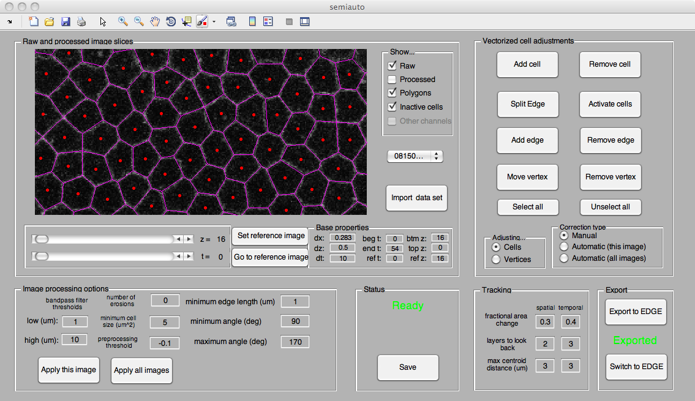
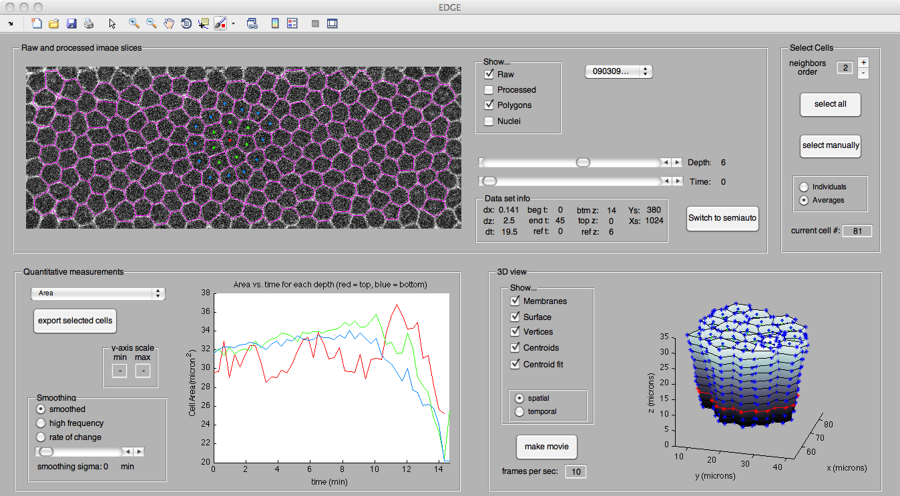
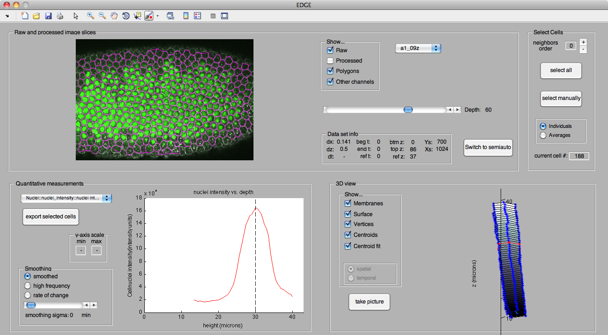

## About ##
Embryo Development Geometry Explorer (EDGE) is a software package for analyzing microscope images of developing embryos. It takes as its input a stack of membrane-tagged images (or, optionally, a "4D" stack that includes a temporal dimension) and builds a 3D reconstruction of the cells. It then can compute various geometric properties of the cells, including user-specified properties through a Matlab API. EDGE was developed specifically for Drosophila embryo development data but can be used for a variety of systems.

EDGE was created by [Michael Gelbart](http://people.seas.harvard.edu/~mgelbart), [Matthias Kaschube](http://fias.uni-frankfurt.de/neuro/kaschube/), [Adam Martin](https://biology.mit.edu/people/adam_martin) and [Eric Wieschaus](http://molbio.princeton.edu/faculty/molbio-faculty/140-wieschaus) at Princeton University.

## Download ##
Download EDGE [here](https://github.com/mgelbart/embryo-development-geometry-explorer/archive/master.zip) or clone the git repository using the link on the right-hand side of this page.

## Documentation ##
* [Installing EDGE](https://github.com/mgelbart/embryo-development-geometry-explorer/blob/wiki/Installation.md)
* [Using the EDGE Importer](https://github.com/mgelbart/embryo-development-geometry-explorer/blob/wiki/Importer.md)
* [Using the EDGE Browser](https://github.com/mgelbart/embryo-development-geometry-explorer/blob/wiki/Browser.md)
* [Keyboard Shortcuts](https://github.com/mgelbart/embryo-development-geometry-explorer/blob/wiki/KeyboardShortcuts.md)
* [List of all Wiki pages](https://github.com/mgelbart/embryo-development-geometry-explorer/tree/wiki)

## Contact ##
Please contact Michael Gelbart at michael (dot) gelbart (at) gmail (dot) com if you have questions or comments.

## Citing EDGE ##
If you use EDGE in your work, please cite the following paper:

Michael A. Gelbart, Bing He, Adam C. Martin, Stephan Thiberge, Eric F. Wieschaus, Matthias Kaschube. Volume conservation principle involved in cell lengthening and nucleus movement during tissue morphogenesis. Proc Natl Acad Sci, 109(47):19298-19303, 2012. [BibTeX](http://people.seas.harvard.edu/~mgelbart/publications/Gelbart2012.bib)

## Screenshots ##

A screenshot of the EDGE Importer showing the polygon-membranes (pink) overlaid over the raw image (grayscale). The red dots show the centroids of all the identified cells. The buttons on the right can be used to fix any errors, and the many other settings allow for control over other aspects of the processing.

A screenshot of the EDGE Browser showing that the membrane detection (polygons, pink) works very well even for noisy data sets. The membranes were produced with minimal manual error-correction.The lower left plot shows area vs. depth for the selected cell (red) and its neighbors (green). A 3D reconstruction of the selected cell and its neighbors are plotted in the lower right.

Another screenshot of the EDGE Browser. This fixed data set has been stained for the nuclei. The nuclei (green) and the polygon membranes (pink) are overlaid on top of the raw data (grayscale).  The bottom plot shows the intensity of the nuclei channel inside the selected cell as a function of depth. The intensity curve exhibits a clear maximum, showing that the nucleus is spatially localized inside the cell.